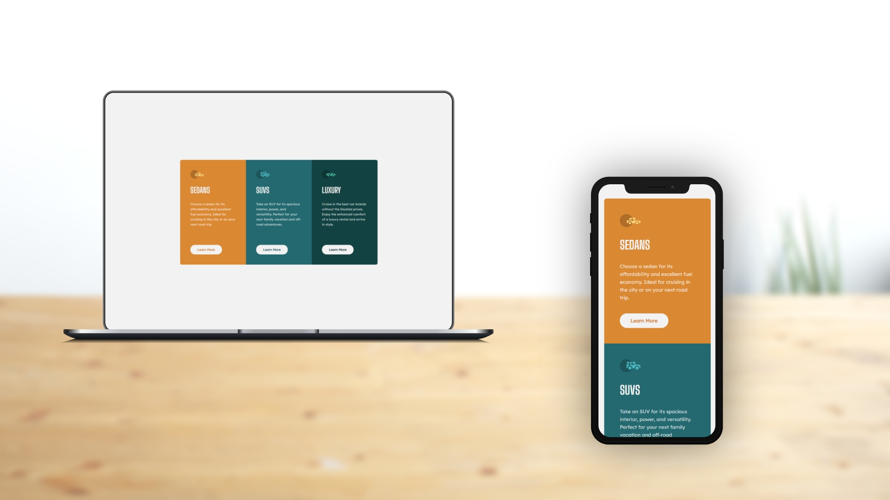

# 3-column preview card component

This is a solution to the [3-column preview card component challenge on Frontend Mentor](https://www.frontendmentor.io/challenges/3column-preview-card-component-pH92eAR2-). Frontend Mentor challenges help you improve your coding skills by building realistic projects. 

## Table of contents

- [3-column preview card component](#3-column-preview-card-component)
  - [Table of contents](#table-of-contents)
  - [Overview](#overview)
    - [The challenge](#the-challenge)
    - [Screenshot](#screenshot)
    - [Links](#links)
  - [Front-end Style Guide](#front-end-style-guide)
    - [Layout](#layout)
    - [Colors](#colors)
    - [Typography](#typography)
    - [Font](#font)
  - [My process](#my-process)
    - [Built with](#built-with)
  - [Author](#author)

## Overview

### The challenge

Users should be able to:

- View the optimal layout depending on their device's screen size
- See hover states for interactive elements

### Screenshot

### Links

- Live Site URL: [https://benjaminvillatte.github.io/fem-3-column-preview-card-component/](https://benjaminvillatte.github.io/fem-3-column-preview-card-component/)

## Front-end Style Guide

### Layout

The designs were created to the following widths:

- Mobile: 375px
- Desktop: 1440px

### Colors

_Primary_

Bright orange: hsl(31, 77%, 52%)
Dark cyan: hsl(184, 100%, 22%)
Very dark cyan: hsl(179, 100%, 13%)

_Neutral_

Transparent white (paragraphs): hsla(0, 0%, 100%, 0.75)
Very light gray (background, headings, buttons): hsl(0, 0%, 95%)

### Typography

- Font size: 15px

### Font

- Family: [Lexend Deca](https://fonts.google.com/specimen/Lexend+Deca)
- Weights: 400

- Family: [Big Shoulders Display](https://fonts.google.com/specimen/Big+Shoulders+Display)
- Weights: 700

## My process

### Built with

- CSS custom properties
- Flexbox
- Mobile-first workflow
- Vitejs for hrm and production build

## Author

- Website - [Benjamin VILLATTE](https://www.benjaminvillatte.fr)
